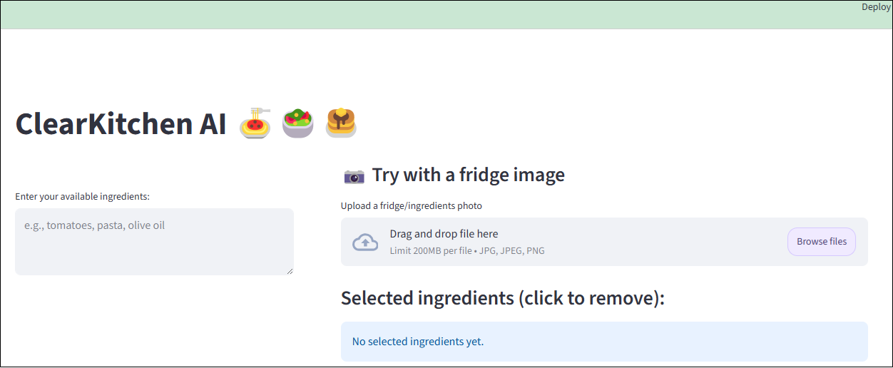

## Overview

ClearKitchen AI is an ingredient-aware recipe generation tool designed to help users decide what to cook based on what they already have. Instead of browsing generic recipe databases, users can input available ingredients and receive a realistic recipe adapted to their constraints, such as dietary preferences or limited cooking time.
The project is implemented as a lightweight web-based prototype, focusing on demonstrating how semantic retrieval and large language models can support everyday cooking decisions.

## Key Features
### Ingredient-Based Input

Users can manually enter a list of ingredients they currently have.
The system is designed to work with partial or loosely defined inputs, reflecting real-world usage.

### Image-Based Ingredient Detection

Users can upload an image of their fridge or ingredients.
The system extracts visible ingredients from the image, which can then be reviewed and adjusted manually before recipe generation.

### Constraint-Aware Recipe Generation

Users may specify constraints such as:

- dietary preferences (e.g., vegetarian)

- maximum cooking time

- ingredients to exclude

These constraints are incorporated into the recipe generation process.

### Semantic Recipe Retrieval

ClearKitchen AI uses embedding-based similarity search to retrieve relevant recipes from a pre-embedded recipe dataset.
This allows the system to identify recipes that are semantically close to the user’s request rather than relying on exact keyword matching.

### LLM-Assisted Recipe Synthesis

Based on retrieved recipes and user inputs, a large language model generates a final recipe that includes:

- a coherent title

- a realistic ingredient list

- step-by-step cooking instructions

The generated recipe is adapted to the available ingredients and avoids introducing unnecessary items.

### Who Is This Tool For?

ClearKitchen AI is intended for:

- students or individuals with limited ingredients

- users with time constraints

- people looking to reduce food waste

- users who prefer guidance instead of browsing long recipe lists

### Implementation Notes
The application is implemented entirely in Python and exposed through a web interface built with Streamlit. It integrates image processing, embedding-based retrieval, and recipe generation into a single pipeline.
